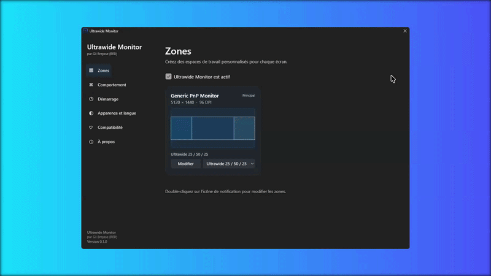
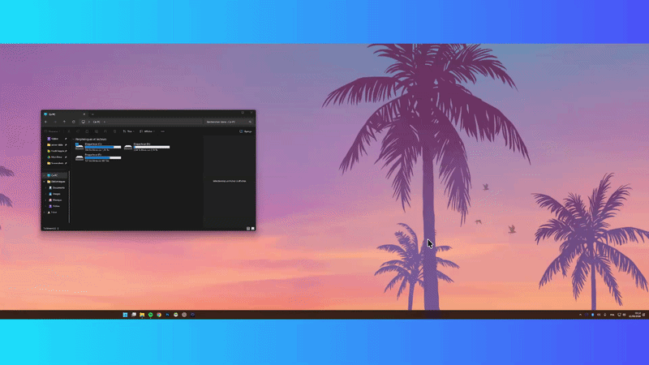

<p align="center">
  
</p>

<h1 align="center">Ultrawide Monitor</h1>

<p align="center">
  Gestionnaire de zones de fenêtres pour Windows 11, pensé pour les écrans larges et ultralarges.
</p>

<p align="center">
  <a href="https://github.com/ImRedTV/Ultrawide-Monitor/releases"></a>
  <a href="https://github.com/ImRedTV/Ultrawide-Monitor/actions/workflows/build.yml"></a>
  <a href="https://github.com/ImRedTV/Ultrawide-Monitor/releases"></a>
</p>

<p align="center">
  
  
  
  
  
</p>

<p align="center">
  <a href="#installation">Installer</a> ·
  <a href="#fonctionnalités">Fonctionnalités</a> ·
  <a href="#compiler-le-projet">Compiler</a> ·
  <a href="#contribuer">Contribuer</a> ·
  <a href="https://github.com/ImRedTV">GitHub de Gil Breysse (RED)</a>
</p>

> **Version initiale — Windows 11 x64**
>
> Ultrawide Monitor est un projet local, sans compte, sans cloud et sans télémétrie. Les moniteurs virtuels, ARM64, les raccourcis globaux personnalisables et les profils par bureau virtuel ne sont pas inclus dans cette version.

## Présentation

Ultrawide Monitor transforme la surface de travail d’un ou plusieurs écrans en zones auxquelles les fenêtres peuvent s’aligner. L’application utilise les fenêtres Windows existantes : elle n’installe aucun pilote et ne crée aucun moniteur virtuel.

La disposition est enregistrée sous forme de ratios normalisés. Elle reste donc cohérente après un changement de résolution, de DPI, de barre des tâches ou après la reconnexion d’un écran.

## Démonstration

L’aperçu ci-dessous montre les paramètres :

<p align="center">
  
</p>

Une fenêtre peut ensuite être déplacée et ajustée dans les zones configurée :

<p align="center">
  
</p>

## Fonctionnalités

- détection des écrans connectés, des coordonnées négatives et des DPI différents ;
- éditeur visuel limité à la surface de travail de l’écran sélectionné ;
- divisions horizontales et verticales avec déplacement fluide des séparateurs ;
- zones collées bord à bord, sans espace ajouté entre les fenêtres ;
- ratios conservés lors des changements de résolution et de mise à l’échelle ;
- presets : zone unique, deux ou trois colonnes, 25/50/25, 30/40/30, deux lignes et grille 2×2 ;
- annulation, rétablissement, réinitialisation, fusion et enregistrement de dispositions personnalisées ;
- maximisation, double-clic de barre de titre, déplacement vers le haut et raccourcis Windows + flèches vers la zone pertinente ;
- restauration de la taille et de la position précédentes d’une fenêtre ;
- aimantation aux bords des zones et de l’écran ;
- menu de zone de notification, démarrage automatique et instance unique ;
- interface française et anglaise, thème clair/sombre suivant Windows ;
- agent séparé pour les fenêtres exécutées avec des droits élevés ;
- configuration locale, journaux locaux tournants et aucune télémétrie.

## Installation

1. Ouvrez la page [Releases](https://github.com/ImRedTV/Ultrawide-Monitor/releases).
2. Téléchargez `UltrawideMonitor-Setup-x64.exe` et, si nécessaire, `SHA256SUMS.txt`.
3. Lancez l’installateur puis suivez l’assistant en français.

L’installateur installe Ultrawide Monitor dans `Program Files`, crée le raccourci du menu Démarrer, configure le démarrage utilisateur et installe l’agent administrateur limité. Le démarrage automatique est activé par défaut. Après une installation interactive, la page **Zones** est affichée ; les connexions suivantes démarrent discrètement dans la zone de notification.

Le programme n’est pas encore signé Authenticode. Windows SmartScreen peut donc afficher un avertissement lors du premier lancement.

Les préférences sont stockées localement dans :

```text
%LocalAppData%\UltrawideMonitor
```

Les anciennes configurations situées dans `%LocalAppData%\UltrawideToys` sont migrées automatiquement lorsqu’elles sont détectées.

## Utilisation rapide

1. Lancez Ultrawide Monitor pour ouvrir les réglages.
2. Dans **Zones**, choisissez un écran puis cliquez sur **Modifier**.
3. Ajoutez ou déplacez les séparateurs, ou sélectionnez un preset.
4. Cliquez sur **Utiliser les zones**.
5. Déplacez, maximisez ou redimensionnez vos fenêtres comme d’habitude.

Un double-clic sur l’icône de notification ouvre directement l’éditeur lorsqu’un seul écran est disponible. Avec plusieurs écrans, il ouvre le sélecteur d’écran. Le clic droit donne accès à l’activation, l’éditeur, les paramètres, le démarrage avec Windows, les informations et la fermeture.

Maintenez **Maj** pour conserver la maximisation Windows sur tout le moniteur. Les fenêtres système, le bureau sécurisé, les applications exclues, les fenêtres non redimensionnables et le plein écran exclusif restent inchangés.

## Arguments internes

```text
--startup                 Démarrage silencieux dans la zone de notification
--settings                Ouvre les paramètres
--editor [monitor-id]     Ouvre l’éditeur d’un écran précis
--elevated-agent          Lance l’agent administrateur limité
--version                 Affiche la version installée
```

## Compiler le projet

### Prérequis

- Windows 11 x64 ;
- SDK .NET 10 ;
- Inno Setup 6, uniquement pour générer l’installateur.

Le fichier `global.json` sélectionne automatiquement un SDK .NET 10 compatible avec la bande de fonctionnalités installée.

```powershell
git clone https://github.com/ImRedTV/Ultrawide-Monitor.git
Set-Location Ultrawide-Monitor

dotnet restore UltrawideMonitor.sln
dotnet test tests/UltrawideToys.Core.Tests/UltrawideToys.Core.Tests.csproj
.\scripts\build.ps1
```

Pour utiliser un SDK installé dans un emplacement personnalisé :

```powershell
$env:ULTRAWIDE_DOTNET = 'C:\Users\<Utilisateur>\.ultrawide-dotnet-sdk\dotnet.exe'
& $env:ULTRAWIDE_DOTNET restore UltrawideMonitor.sln
& $env:ULTRAWIDE_DOTNET test tests/UltrawideToys.Core.Tests/UltrawideToys.Core.Tests.csproj
```

Le script de build :

- restaure la solution et exécute les tests ;
- publie l’application et l’agent en x64 autonome, sans runtime .NET à installer ;
- génère `UltrawideMonitor-Setup-x64.exe` avec Inno Setup ;
- crée `SHA256SUMS.txt` pour vérifier l’intégrité de l’installateur.

Les artefacts sont placés dans `artifacts/publish` et `artifacts/installer`. Ils sont ignorés par Git et destinés aux Releases, pas au dépôt source.

## Organisation du dépôt

```text
src/UltrawideToys.Core          bibliothèque métier et moteur de fenêtres
src/UltrawideToys.App           interface WPF, paramètres et zone de notification
src/UltrawideToys.Agent         agent administrateur limité par canal nommé
tests/UltrawideToys.Core.Tests  tests de calculs, ratios et persistance
tests/WindowProbe               outil de vérification des fenêtres Windows
installer/                      script Inno Setup et licence de l’installateur
scripts/                        scripts reproductibles de build et validation
.github/                        workflow CI, modèles d’issues et pull requests
```

## Automatisation GitHub

Le workflow [Build and release](.github/workflows/build.yml) :

- compile et teste chaque pull request et chaque push sur `main` ;
- publie les artefacts x64 dans GitHub Actions ;
- crée une Release brouillon lorsqu’un tag `v*` est poussé ;
- joint l’installateur et son fichier SHA-256 à cette Release.

Pour préparer une version :

```powershell
git tag v0.1.0
git push origin v0.1.0
```

## Contribuer

Les contributions sont les bienvenues. Avant d’ouvrir une issue ou une pull request :

1. lisez [CONTRIBUTING.md](CONTRIBUTING.md) ;
2. reproduisez le problème sur Windows 11 x64 ;
3. exécutez `dotnet test` et `scripts/validate.ps1` ;
4. décrivez les changements et les scénarios vérifiés.

Merci de ne pas inclure de données personnelles, de journaux utilisateur ou d’artefacts générés dans une contribution.

## Confidentialité et sécurité

Ultrawide Monitor ne collecte aucune télémétrie et ne nécessite aucun compte. Les réglages et journaux restent sur la machine. Pour signaler une vulnérabilité, consultez [SECURITY.md](SECURITY.md) plutôt que de publier les détails dans une issue.

## Licence

Ultrawide Monitor est autorisé pour un usage personnel et non commercial uniquement. Toute utilisation commerciale, redistribution commerciale, intégration payante ou revente nécessite l’autorisation écrite de Gil Breysse (RED).

Voir le texte complet dans [LICENSE](LICENSE). Cette licence personnelle et non commerciale n’est pas une licence open source approuvée par l’OSI.

## Crédits

Projet et identité visuelle par [Gil Breysse (RED)](https://github.com/ImRedTV).

<p align="center">
  <a href="https://github.com/ImRedTV/Ultrawide-Monitor">Voir le dépôt GitHub</a> ·
  <a href="https://github.com/ImRedTV/Ultrawide-Monitor/releases">Télécharger une version</a>
</p>

<p align="center">
  <sub>Logiciel propulsé par OpenAI</sub><br>
  <a href="https://openai.com/brand/" title="Directives de design OpenAI">
    
  </a><br>
  <sub>Logo utilisé conformément aux directives de marque OpenAI. Cette mention ne constitue pas une approbation ni une affiliation officielle.</sub>
</p>
